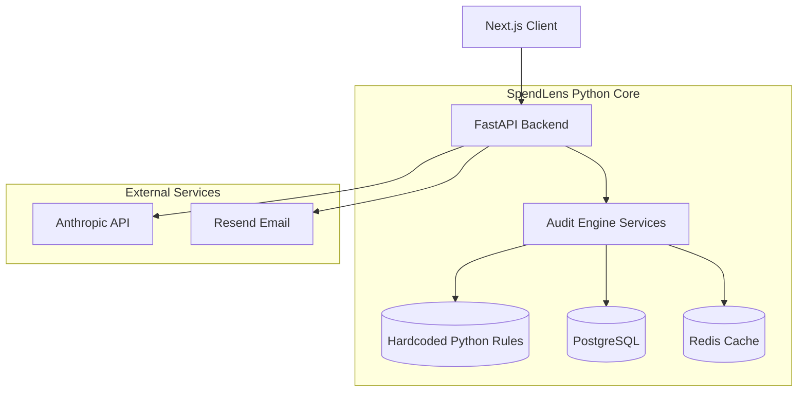

# Architecture & Design

## System Diagram

## Data Flow
1. **Input**: User submits array of tools, plans, seats, and spend via frontend.
2. **Audit**: POST `/api/v1/audit` executes deterministic engine checks in FastAPI.
3. **Storage**: Audit is saved to PostgreSQL; an ID/token is returned.
4. **Summary**: Frontend calls `/api/v1/summary` with ID; API queries Claude and updates DB.
5. **Share**: GET `/api/v1/share/{token}` fetches PII-stripped data for public viewing.
6. **Lead**: User submits email; POST `/api/v1/lead` saves to DB and triggers Resend email.

## 10k/Day Scaling Plan
If SpendLens goes viral and hits 10,000 audits per day:
- **Database**: PostgreSQL handles 10k inserts/day effortlessly. We use Redis to cache pricing data.
- **AI Cost**: 10,000 Claude calls/day = ~$150/day. The FastAPI backend natively supports Celery, allowing us to move the Claude call to a background queue to prevent timeout failures.
- **Compute**: The Dockerized FastAPI backend can be horizontally scaled across multiple ECS/Kubernetes pods, with an NGINX load balancer distributing traffic.
